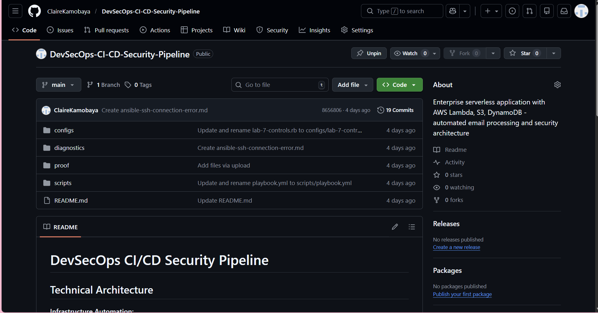

# Lab 01: Infrastructure Audit
**Name:** Claire Kamobaya
**Date:** January 29, 2026
**Status:** Completed

## 🎯 Objective
To document the 2021 Facebook outage and practice using GitHub for enterprise documentation.

## 🔍 Key Findings (Case Study)
1. **The Event:** Facebook (Meta) disappeared from the internet because of a configuration error.
2. **The Technical Cause:** A bad command deleted the BGP (Border Gateway Protocol) routes.
3. **The Impact:** DNS resolvers could not find Facebook's servers.

## 💡 Lessons Learned
This lab demonstrated the critical importance of proper change management and configuration validation in production environments. A single misconfigured BGP route caused a global outage affecting billions of users, highlighting how infrastructure documentation and rollback procedures are essential security controls. This reinforces why Version Control Systems like Git are industry-standard tools - they provide an audit trail and allow rapid recovery from configuration errors.

## 📸 Proof of Work

