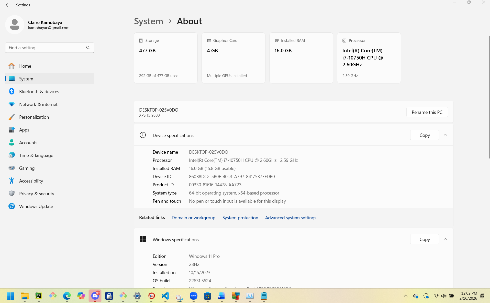

\# Lab 02: System Audit

Claire Kamobaya

February 16, 2026

---

\## Section 1: System Inventory

| Component | Specification |

|-----------|---------------|

| Operating System | Windows 11 Pro |

| Total Installed RAM | 16.0 GB |

| CPU Model \& Clock Speed | Intel(R) Core(TM) i7-10750H CPU @ 2.60GHz |

---

\## Section 2: The Access Control Model

\### Model Definition

My operating system (Windows 11 Pro) uses \*\*DAC (Discretionary Access Control)\*\* as its primary access control model.

\*\*Definition:\*\* Discretionary Access Control is a security model where the owner of a resource (such as a file or folder) has the authority to decide who can access that resource and what permissions they have. The resource owner has complete discretion over access rights, allowing them to grant or revoke permissions to other users.

\### Relationship to Permissions

In DAC, the file or resource owner assigns Read (R), Write (W), and Execute (X) permissions to users or groups. Windows implements DAC through Access Control Lists (ACLs), where each file and folder maintains a list specifying which users and groups have which permissions. For example, a file owner can grant Read-only access to some users while allowing full Read/Write/Execute access to others. The owner controls these permissions through the file's Properties → Security tab.

\### Principle of Least Privilege (PoLP) Application

Windows administrators apply PoLP by creating different account types with varying permission levels. Standard user accounts operate with limited permissions and cannot install software, modify system files, or change system-wide settings. Administrative accounts have elevated privileges but should only be used when necessary. Windows enforces this through User Account Control (UAC), which prompts users to confirm administrative actions. This ensures users operate with minimal permissions for daily tasks and only elevate privileges when absolutely required.

\*\*Concrete Example:\*\*

In a corporate environment, an administrator creates a service account for an automated backup application. This service account is granted Read-only permissions on the folders containing user documents (C:\\Users\\Documents) and company files (D:\\SharedData). The account is explicitly denied Write and Execute permissions on system directories like C:\\Windows and C:\\Program Files. If the backup service were compromised through a vulnerability, attackers would be unable to modify system files, install malicious software, or execute arbitrary code—they could only read the backup data, limiting the potential damage.

---

\## Section 3: Top Process Analysis \& Risk

\### Process 1: msedge.exe

\- \*\*Process Name:\*\* msedge.exe

\- \*\*Process ID (PID):\*\* 42792

\- \*\*Resource Consumption:\*\* Memory: 191 MB

\*\*Security Risk Hypothesis:\*\*

If the Microsoft Edge browser process were compromised through a malicious browser extension or zero-day exploit, an attacker could intercept user credentials, steal session cookies, or inject malicious JavaScript to perform phishing attacks. Since browsers handle sensitive data including passwords, banking information, and personal communications, a compromised browser represents a significant data leakage risk. Additionally, attackers could leverage browser permissions to access the webcam, microphone, or file system, potentially enabling lateral movement to other applications or exfiltration of local files.

\### Process 2: explorer.exe

\- \*\*Process Name:\*\* explorer.exe

\- \*\*Process ID (PID):\*\* 9536

\- \*\*Resource Consumption:\*\* Memory: 123 MB

\*\*Security Risk Hypothesis:\*\*

If Windows Explorer were compromised through a privilege escalation vulnerability, an attacker could gain control over file system operations with the same permissions as the logged-in user. This could enable them to delete critical system files (causing Denial of Service), modify security descriptors to escalate privileges, or inject malicious code into other running processes. Since explorer.exe runs continuously with user-level permissions and manages the desktop environment, it represents a single point of failure—compromising it could allow attackers to manipulate what users see, hide malicious files, or intercept file operations across the entire system.

\### Process 3: Code.exe

\- \*\*Process Name:\*\* Code.exe

\- \*\*Process ID (PID):\*\* 14792

\- \*\*Resource Consumption:\*\* Memory: 105 MB

\*\*Security Risk Hypothesis:\*\*

If Visual Studio Code were compromised through a malicious extension or supply chain attack, an attacker could gain access to all source code, configuration files, API keys, and credentials stored in the development environment. Since VS Code often runs with the same permissions as the user and has access to version control systems like Git, attackers could exfiltrate proprietary code, inject backdoors into software projects, or steal authentication tokens for cloud services and repositories. This represents both a data leakage risk and a potential supply chain compromise, as malicious code could be committed to production repositories without the developer's knowledge.

---

\## Section 4: Submission Checklist

\- \[x] File named correctly: System-Audit.md

\- \[x] All sections completed with accurate information

\- \[x] Proper Markdown formatting used

\- \[x] Spell-checked and proofread

\- \[ ] Committed to GitHub with meaningful message

\- \[ ] Repository link verified

